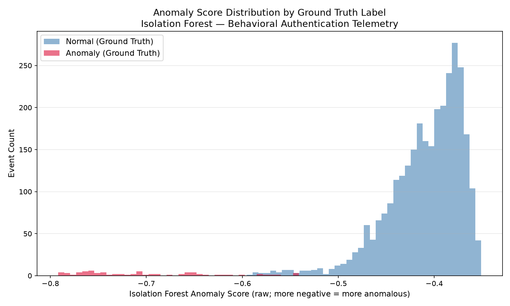
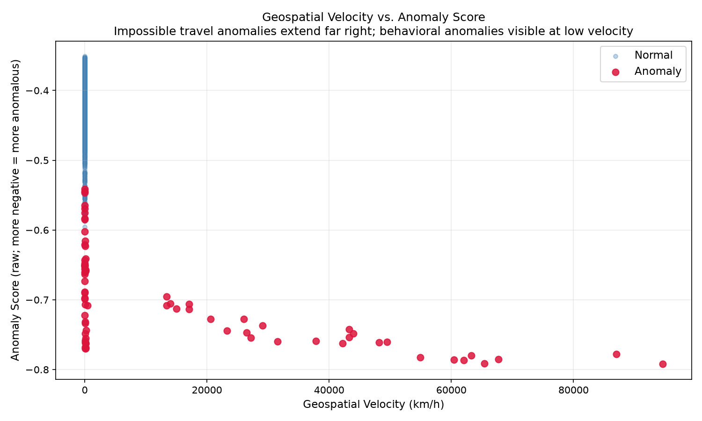

# Behavioral Anomaly Detection for Identity Threat Detection
### An Unsupervised Machine Learning Approach to MITRE ATT&CK T1078 Detection

**Author:** Benjamin Brady  
**Date:** June 2026  
**Repository:** [github.com/BenBrady1/behavioral-anomaly-detection](https://github.com/BenBrady1/behavioral-anomaly-detection)

---

## Abstract

This project implements an unsupervised behavioral anomaly detection pipeline targeting identity-based threats in authentication event telemetry. Using an Isolation Forest model (Liu et al., 2008), the system detects four categories of anomalous login behavior — impossible travel, typing speed deviation, click-through rate deviation, and session timing anomalies — without requiring labeled training data. The approach maps directly to MITRE ATT&CK T1078 (Valid Accounts), one of the most prevalent techniques in real-world credential compromise attacks. Evaluated against a synthetic dataset of 3,074 login events with 74 injected ground-truth anomalies, the model achieves **92% recall** and **88% precision** at a 2.5% contamination threshold, demonstrating that multi-signal behavioral analysis can surface credential abuse with high fidelity in the absence of labeled attack data.

---

## 1. Background and Motivation

### 1.1 The Identity Threat Landscape

Credential compromise represents one of the most persistent and damaging attack vectors in modern enterprise security. MITRE ATT&CK T1078 (Valid Accounts) describes adversaries obtaining and abusing legitimate credentials to achieve initial access, maintain persistence, escalate privileges, or evade detection. Because the attacker authenticates as an authorized user, traditional perimeter-based controls — firewalls, network segmentation, VPN access controls — provide no meaningful defense. The attack is, by definition, invisible to systems that trust network location.

The Zero Trust Architecture model (NIST SP 800-207, 2020) addresses this by eliminating implicit trust based on network location and requiring continuous verification of every access request. Under Zero Trust Network Access (ZTNA), access decisions are not binary (authenticated / not authenticated) but continuous and risk-informed: behavioral signals, device posture, and contextual anomalies are evaluated on every session, and access is adapted or revoked dynamically as risk signals change.

This project implements the detection layer that makes continuous verification actionable: a behavioral anomaly scoring pipeline that surfaces high-risk sessions for review or automated enforcement.

### 1.2 Why Unsupervised Detection

Supervised classification requires labeled examples of attack behavior. In practice, labeled attack data is scarce, rapidly evolving, and biased toward known attack patterns. An adversary using a novel credential stuffing technique or a previously unseen exfiltration path will not appear in a supervised model's training distribution.

Unsupervised anomaly detection sidesteps this constraint by modeling the distribution of normal behavior and flagging deviations — regardless of whether the specific deviation has been observed before. This is particularly suited to identity threat detection, where the signal of interest is not "this looks like a known attack" but "this does not look like this user."

---

## 2. Dataset

### 2.1 Synthetic Data Generation

The dataset was generated synthetically to enable rigorous evaluation with known ground truth labels, following standard practice in anomaly detection benchmarking where real behavioral data is not publicly available due to privacy constraints.

The generator (`Data/generate_data.py`) produces authentication event telemetry for 50 simulated users over approximately 60 login events each (two months of daily logins), yielding 3,000 normal baseline events. Each user is assigned a home city drawn from a pool of eight U.S. metropolitan areas, a baseline typing speed drawn from N(65, 8) WPM, a baseline click-through rate drawn from N(0.35, 0.05), and a characteristic login hour drawn from U[7, 10].

### 2.2 Anomaly Injection

74 anomalies were injected across four categories, chosen to reflect the behavioral signals described in the MITRE ATT&CK T1078 detection guidance:

| Anomaly Type | Count | Description |
|---|---|---|
| Impossible Travel | 30 | Login from a geographically distant city within 5–30 minutes of the last domestic login, implying physically impossible transit velocity |
| Typing Speed Deviation | 18 | Typing speed far below baseline (attacker unfamiliar with system) or far above baseline (scripted/automated access) |
| Click-Through Rate Deviation | 15 | CTR near zero (bot-like navigation) or near 1.0 (scripted enumeration) |
| Session Timing Anomaly | 11 | Login between 1–4 AM, outside the user's established baseline hours |
| **Total** | **74** | **Anomaly rate: 2.41%** |

The 2.41% anomaly rate is consistent with reported base rates in enterprise authentication telemetry (Chandola et al., 2009).

Impossible travel cities were drawn from a pool of four international locations (Beijing, Moscow, Lagos, Tehran). The implied transit velocity for each impossible travel event — computed via the Haversine great-circle distance formula between the home city and the anomaly city, divided by the elapsed time in hours — ranges from approximately 8,000 to 94,000 km/h, well exceeding the ~1,200 km/h threshold of commercial aviation.

---

## 3. Methodology

### 3.1 Feature Engineering

Six behavioral features were derived from the raw event log for each login event:

| Feature | Description | Anomaly Signal |
|---|---|---|
| `typing_speed_wpm` | Words per minute at login | Unusually slow (unfamiliar attacker) or fast (scripted) |
| `click_through_rate` | Session CTR | Near-zero (bot) or near-1.0 (script) |
| `login_hour` | Hour of day (0–23) | Login at 1–4 AM outside user baseline |
| `hours_since_last_login` | Elapsed hours since prior login by same user | Unusually short interval preceding impossible travel |
| `distance_from_last_login` | Great-circle distance in km from prior login location | Large distance = potential impossible travel |
| `velocity_kmh` | Implied transit speed (distance / time) | Values exceeding ~1,200 km/h indicate impossible travel |

Sequential features (`hours_since_last_login`, `distance_from_last_login`, `velocity_kmh`) were derived by sorting events by user and timestamp, then using the pandas `shift(1)` operation to retrieve the immediately preceding event within each user context. First login events per user produce NaN for sequential features, imputed with zero — representing the absence of a prior baseline rather than a meaningful behavioral measurement.

The Haversine formula was used for all distance calculations:

```
d = 2R · arcsin(√(sin²(Δlat/2) + cos(lat₁)·cos(lat₂)·sin²(Δlon/2)))
```

where R = 6,371 km (mean Earth radius).

### 3.2 Model: Isolation Forest

The Isolation Forest algorithm (Liu, Ting & Zhou, 2008) was selected for the following properties:

**Isolation principle:** Anomalies are few and different. In a random partitioning of the feature space, anomalous observations — sitting in sparse regions — are isolated in fewer splits than normal observations, which cluster densely and require many splits to separate. The anomaly score is derived from the average path length to isolation across an ensemble of trees: shorter average path = higher anomaly likelihood.

**Unsupervised:** No labeled attack data is required. The model learns the structure of normal behavior implicitly from the full dataset.

**Scalability:** Linear time complexity O(n) with a low memory footprint, appropriate for high-throughput authentication telemetry.

**No distributional assumption:** Unlike statistical methods that assume normality, Isolation Forest makes no assumption about the underlying distribution — important given the multimodal nature of behavioral features across users.

**Model configuration:**
- `n_estimators = 100` (ensemble size per Liu et al., 2008 recommendation)
- `contamination = 0.025` (approximation of the known 2.41% anomaly rate)
- `random_state = 42` (full reproducibility)

Anomaly scores are returned as raw values by sklearn's `score_samples()` method: more negative values indicate shorter average isolation paths and higher anomaly likelihood. Scores are retained in raw form without sign inversion.

---

## 4. Results

### 4.1 Classification Performance

Evaluated against ground truth labels on the full dataset:

```
              precision    recall  f1-score   support

           0       1.00      1.00      1.00      3000
           1       0.88      0.92      0.90        74

    accuracy                           1.00      3074
   macro avg       0.94      0.96      0.95      3074
weighted avg       1.00      1.00      1.00      3074
```

**Confusion Matrix (normalized by actual class):**

|  | Predicted Normal | Predicted Anomaly |
|---|---|---|
| **Actual Normal** | 1.00 (2,991) | 0.00 (9) |
| **Actual Anomaly** | 0.08 (6) | 0.92 (68) |

The model correctly identified 68 of 74 injected anomalies (92% recall) with 9 false positives from the 3,000 normal events (0.3% false positive rate). In production security contexts, recall is the primary optimization target: a missed attack (false negative) has greater consequence than a false alarm (false positive). A 92% recall rate on an unsupervised model with no labeled training data is a meaningful result.

### 4.2 Score Distribution



The anomaly score distributions for normal and anomalous events show clear separation: normal events cluster around -0.40 to -0.55, while anomalous events concentrate below -0.60, with impossible travel events reaching -0.79. The overlap region corresponds to the 6 false negatives and 9 false positives.

### 4.3 Velocity vs. Anomaly Score



The scatter plot illustrates the dominant contribution of impossible travel to the detection signal. Normal events cluster at near-zero velocity with scores around -0.40 to -0.55 (blue). Behavioral anomalies (typing speed, CTR, session timing) appear at near-zero velocity with more negative scores (orange, left cluster) — caught by behavioral signals despite no location change. Impossible travel anomalies extend to the right with velocities ranging from ~8,000 to ~94,000 km/h and anomaly scores approaching -0.80, confirming the model's sensitivity to geospatial velocity.

The orange points at low velocity represent a significant finding: **behavioral signals detect credential abuse even when the attacker masks their location.** A sophisticated adversary using a VPN or proxy to simulate their victim's geographic location would evade impossible travel detection but remain detectable through typing cadence or click-pattern deviations.

---

## 5. Limitations

The following limitations are acknowledged and should inform any production application of this approach:

1. **Synthetic data:** The dataset was generated under controlled probabilistic assumptions. Real authentication telemetry exhibits correlated noise, irregular login patterns (travel, shift work, shared devices), and a higher diversity of behavioral profiles. Model performance on real data would require separate empirical evaluation.

2. **No per-user behavioral baseline:** This implementation trains a single population-level model. A production system should maintain per-user behavioral baselines and score deviations relative to each user's individual history — not the population mean. A 3 AM login is anomalous for most users but normal for a security analyst on overnight rotation.

3. **Static contamination parameter:** The `contamination` parameter was set using known dataset properties. In production, the true anomaly rate is unknown and may vary seasonally, by user population, or following security incidents. Adaptive contamination estimation would be required.

4. **No temporal model:** Isolation Forest treats each event independently. A production behavioral system would incorporate temporal sequence modeling — session-level patterns, login frequency trends, and behavioral drift over time — which this implementation does not capture.

5. **Feature set scope:** The six features modeled represent a subset of the behavioral signals available in enterprise authentication telemetry. Production systems typically incorporate device fingerprinting, network characteristics, application access patterns, and identity provider risk signals.

---

## 6. References

Liu, F. T., Ting, K. M., & Zhou, Z. H. (2008). Isolation Forest. *Proceedings of the IEEE International Conference on Data Mining*, 413–422.

MITRE ATT&CK. (2024). *Valid Accounts (T1078)*. https://attack.mitre.org/techniques/T1078/

NIST Special Publication 800-207. (2020). *Zero Trust Architecture*. National Institute of Standards and Technology. https://csrc.nist.gov/pubs/sp/800/207/final

Chandola, V., Banerjee, A., & Kumar, V. (2009). Anomaly detection: A survey. *ACM Computing Surveys*, 41(3), 1–58.

Schölkopf, B., Platt, J. C., Shawe-Taylor, J., Smola, A. J., & Williamson, R. C. (2001). Estimating the support of a high-dimensional distribution. *Neural Computation*, 13(7), 1443–1471.

---

## 7. Tech Stack

Python 3.12 · pandas · scikit-learn · matplotlib · seaborn · NumPy

---

## 8. Reproduce

```bash
git clone https://github.com/BenBrady1/behavioral-anomaly-detection
cd behavioral-anomaly-detection
pip install -r requirements.txt
python Data/generate_data.py
python Models/detect.py
```

Output files will be written to `Outputs/`.
