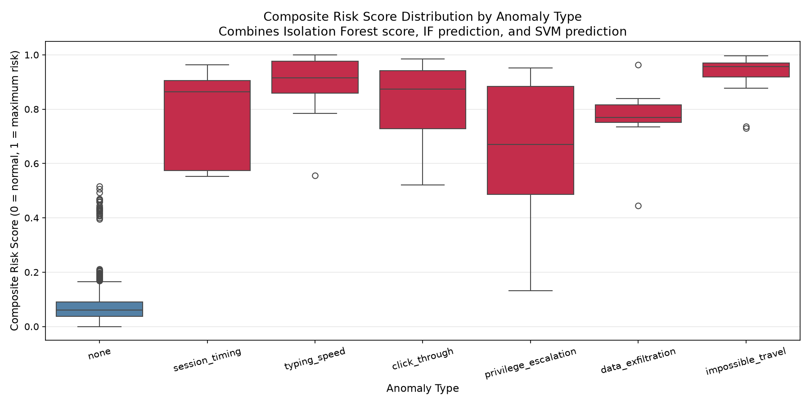
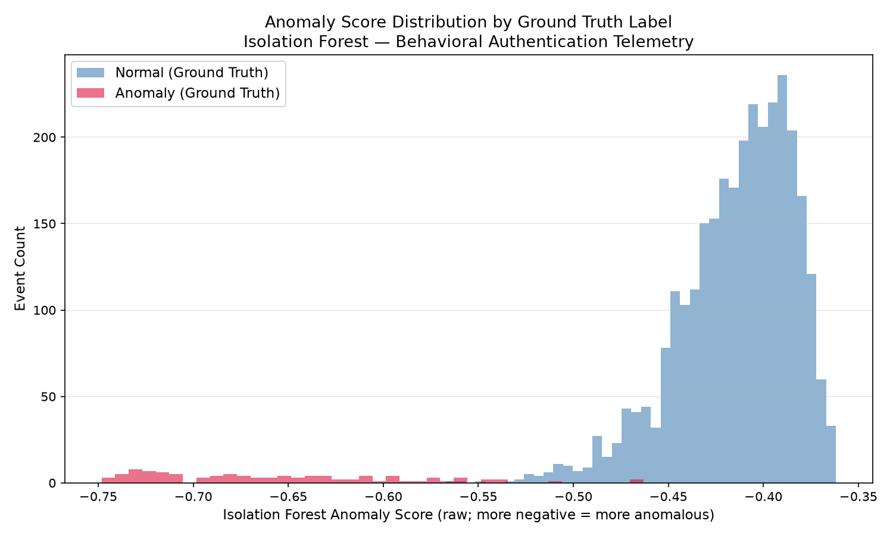
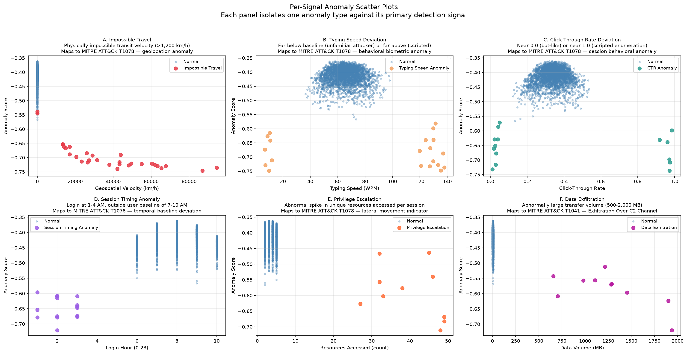
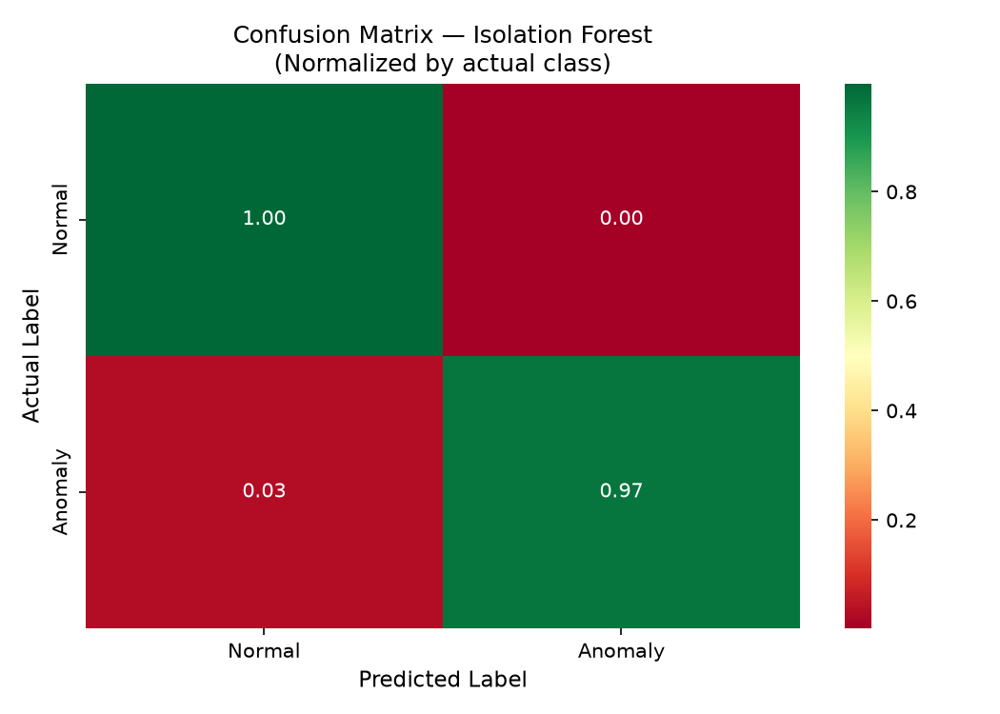

# Behavioral Anomaly Detection for Identity Threat Detection
### A Multi-Signal, Multi-Model Approach to MITRE ATT&CK T1078 and T1041 Detection

**Author:** Benjamin Brady  
**Date:** June 2026  
**Repository:** [github.com/BenBrady1/Behavioral_Anomaly_detection](https://github.com/BenBrady1/Behavioral_Anomaly_detection)

---

## Abstract

This project implements a modular, unsupervised behavioral anomaly detection pipeline targeting identity-based threats in authentication event telemetry. Two complementary models — Isolation Forest (Liu et al., 2008) and One-Class SVM (Schölkopf et al., 1999) — detect six categories of anomalous login behavior across behavioral biometric, geospatial, temporal, resource access, and data transfer signal domains. Detection outputs are aggregated into a composite risk score and mapped to a formal MITRE ATT&CK taxonomy. Evaluated against a synthetic dataset of 3,100 login events with 100 injected ground-truth anomalies, Isolation Forest achieves **97% recall** and **94% precision**, and One-Class SVM achieves **84% recall** and **83% precision**, demonstrating meaningful tradeoffs between the two approaches on clean behavioral telemetry.

---

## 1. Background and Motivation

### 1.1 The Identity Threat Landscape

Credential compromise represents one of the most persistent and damaging attack vectors in modern enterprise security. MITRE ATT&CK T1078 (Valid Accounts) describes adversaries obtaining and abusing legitimate credentials to achieve initial access, maintain persistence, escalate privileges, or evade detection. Because the attacker authenticates as an authorized user, traditional perimeter-based controls — firewalls, network segmentation, VPN access controls — provide no meaningful defense. The attack is, by definition, invisible to systems that trust network location.

The Zero Trust Architecture model (NIST SP 800-207, 2020) addresses this by eliminating implicit trust based on network location and requiring continuous verification of every access request. Under Zero Trust Network Access (ZTNA), access decisions are not binary (authenticated / not authenticated) but continuous and risk-informed: behavioral signals, device posture, and contextual anomalies are evaluated on every session, and access is adapted or revoked dynamically as risk signals change.

This project implements the detection layer that makes continuous verification actionable: a behavioral anomaly scoring pipeline that surfaces high-risk sessions for review or automated enforcement.

### 1.2 Why Unsupervised Detection

Supervised classification requires labeled examples of attack behavior. In practice, labeled attack data is scarce, rapidly evolving, and biased toward known attack patterns. An adversary using a novel credential stuffing technique or a previously unseen exfiltration path will not appear in a supervised model's training distribution.

Unsupervised anomaly detection sidesteps this constraint by modeling the distribution of normal behavior and flagging deviations — regardless of whether the specific deviation has been observed before. This is particularly suited to identity threat detection, where the signal of interest is not "this looks like a known attack" but "this does not look like this user."

---

## 2. Dataset

### 2.1 Synthetic Data Generation

The dataset was generated synthetically to enable rigorous evaluation with known ground truth labels, following standard practice in anomaly detection benchmarking where real behavioral data is not publicly available due to privacy constraints.

The generator (`Data/generate_data.py`) produces authentication event telemetry for 50 simulated users over approximately 60 login events each (two months of daily logins), yielding 3,000 normal baseline events. Each user is assigned a home city drawn from a pool of eight U.S. metropolitan areas, a baseline typing speed drawn from N(65, 8) WPM, a baseline click-through rate drawn from N(0.35, 0.05), a characteristic login hour drawn from U[7, 10], a baseline resource access count drawn from U[2, 5], and a baseline data transfer volume drawn from U[0.5, 10.0] MB.

### 2.2 Anomaly Injection

100 anomalies were injected across six categories, chosen to reflect behavioral signals described in MITRE ATT&CK T1078 and T1041 detection guidance:

| Anomaly Type | Count | ATT&CK | Description |
|---|---|---|---|
| Impossible Travel | 30 | T1078 | Login from a geographically distant city within 5–30 minutes of the last domestic login, implying physically impossible transit velocity |
| Typing Speed Deviation | 20 | T1078 | Typing speed far below baseline (attacker unfamiliar with system) or far above baseline (scripted/automated access) |
| Click-Through Rate Deviation | 15 | T1078 | CTR near zero (bot-like navigation) or near 1.0 (scripted enumeration) |
| Session Timing Anomaly | 15 | T1078 | Login between 1–4 AM, outside the user's established baseline hours |
| Privilege Escalation | 10 | T1078 | Abnormal spike in unique resources accessed per session (20–50 vs. normal 2–5) |
| Data Exfiltration | 10 | T1041 | Abnormally large data transfer volume (500–2,000 MB vs. normal 0.5–10 MB) |
| **Total** | **100** | | **Anomaly rate: 3.23%** |

The 3.23% anomaly rate is consistent with reported base rates in enterprise authentication telemetry (Chandola et al., 2009).

---

## 3. Methodology

### 3.1 Pipeline Architecture

The pipeline is implemented as a modular Python package with one file per concern:

```
Models/
├── detect.py            — orchestrator: runs pipeline in sequence
├── features.py          — data ingestion and feature engineering
├── isolation_forest.py  — Isolation Forest model
├── one_class_svm.py     — One-Class SVM model
├── evaluate.py          — classification reports, risk scoring, ATT&CK taxonomy
└── visualize.py         — all output visualizations
```

### 3.2 Feature Engineering

Eight behavioral features were derived from the raw event log:

| Feature | Description | Anomaly Signal |
|---|---|---|
| `typing_speed_wpm` | Words per minute at login | Unusually slow (unfamiliar attacker) or fast (scripted) |
| `click_through_rate` | Session CTR | Near-zero (bot) or near-1.0 (script) |
| `login_hour` | Hour of day (0–23) | Login at 1–4 AM outside user baseline |
| `hours_since_last_login` | Elapsed hours since prior login by same user | Unusually short interval preceding impossible travel |
| `distance_from_last_login` | Great-circle distance in km from prior login location | Large distance = potential impossible travel |
| `velocity_kmh` | Implied transit speed (distance / time) | Values exceeding ~1,200 km/h indicate impossible travel |
| `resources_accessed` | Count of unique resources accessed per session | Spike indicates lateral movement / privilege escalation |
| `data_volume_mb` | Data transferred in session (MB) | Spike indicates potential exfiltration |

Sequential features were derived using the pandas `shift(1)` operation within each user group. First login events per user produce NaN, imputed with zero.

The Haversine formula was used for all distance calculations:

```
d = 2R · arcsin(sqrt(sin²(Δlat/2) + cos(lat₁)·cos(lat₂)·sin²(Δlon/2)))
```

where R = 6,371 km (mean Earth radius).

### 3.3 Model 1 — Isolation Forest

The Isolation Forest algorithm (Liu, Ting & Zhou, 2008) detects anomalies by recursively partitioning the feature space using random splits. Anomalous observations, being few and distinct, are isolated in fewer splits than normal observations, yielding shorter average path lengths across the ensemble of trees.

**Configuration:** `n_estimators=100`, `contamination=0.033`, `random_state=42`

### 3.4 Model 2 — One-Class SVM

One-Class SVM (Schölkopf et al., 1999) learns a decision boundary around normal data in a kernel-transformed feature space via the RBF kernel. Points falling outside the boundary are classified as anomalous.

**Configuration:** `kernel='rbf'`, `nu=0.033`

**Model comparison rationale:** Isolation Forest is the primary model for its linear time complexity O(n), scalability to high-dimensional data, and lack of distributional assumptions. One-Class SVM is included as a comparative model — it produces tighter boundaries on clean data but is computationally heavier and less scalable to production telemetry volumes.

### 3.5 Composite Risk Score

Detection outputs from both models are aggregated into a single continuous risk score per event:

```
composite_risk_score = (anomaly_score_normalized × 0.5) +
                       (if_predicted_binary × 0.25) +
                       (svm_predicted_binary × 0.25)
```

The Isolation Forest anomaly score is min-max normalized to [0, 1] and inverted so that higher values indicate greater anomaly likelihood. The continuous score receives 50% weight; each binary model prediction receives 25%, reflecting the information advantage of a continuous signal over a binary classification.

### 3.6 ATT&CK Taxonomy

Each event is tagged with a formal MITRE ATT&CK technique ID in the output:

| Anomaly Type | Technique |
|---|---|
| impossible_travel, typing_speed, click_through, session_timing, privilege_escalation | T1078 — Valid Accounts |
| data_exfiltration | T1041 — Exfiltration Over C2 Channel |
| none (normal) | N/A |

---

## 4. Results

### 4.1 Isolation Forest — Classification Performance

```
              precision    recall  f1-score   support

           0       1.00      1.00      1.00      3000
           1       0.94      0.97      0.96       100

    accuracy                           1.00      3100
   macro avg       0.97      0.98      0.98      3100
weighted avg       1.00      1.00      1.00      3100
```

**Confusion Matrix:** 2,994 true negatives | 97 true positives | 6 false positives | 3 false negatives

### 4.2 One-Class SVM — Classification Performance

```
              precision    recall  f1-score   support

           0       0.99      0.99      0.99      3000
           1       0.83      0.84      0.84       100

    accuracy                           0.99      3100
   macro avg       0.91      0.92      0.92      3100
weighted avg       0.99      0.99      0.99      3100
```

**Confusion Matrix:** 2,983 true negatives | 84 true positives | 17 false positives | 16 false negatives

### 4.3 Model Comparison

| Metric | Isolation Forest | One-Class SVM |
|---|---|---|
| Precision | 0.94 | 0.83 |
| Recall | 0.97 | 0.84 |
| F1 Score | 0.96 | 0.84 |
| False Positives | 6 | 17 |
| False Negatives | 3 | 16 |

Isolation Forest outperforms One-Class SVM across all metrics on this dataset. This is consistent with the literature: Isolation Forest's random partitioning approach is less sensitive to the shape of the feature distribution than SVM's boundary-learning approach, making it more robust on multimodal behavioral data.

**Note on performance inflation:** Both models show elevated metrics attributable to the clean distributional separation inherent in synthetic data. Real authentication telemetry exhibits correlated noise, overlapping behavioral profiles, and gradual drift that would reduce precision and recall in production. These results should be interpreted as proof-of-concept validation, not production performance estimates.

### 4.4 Composite Risk Score Distribution



Normal events cluster tightly near zero. Impossible travel shows the tightest, highest distribution — most confidently detected. Privilege escalation shows the widest spread, reflecting the subtler nature of the resource access signal and higher model uncertainty at the detection boundary.

### 4.5 Anomaly Score Distribution



Clear separation between normal and anomalous Isolation Forest score distributions confirms the learned feature space meaningfully discriminates between the two classes.

### 4.6 Per-Signal Scatter Plots



Six panels isolating each anomaly type against its primary detection signal.

### 4.7 Confusion Matrix



---

## 5. Limitations

1. **Synthetic data:** Clean distributional separation inflates model performance relative to production expectations. Real telemetry requires empirical re-evaluation.

2. **No per-user behavioral baseline:** A production system must maintain per-user baselines. A 3 AM login is anomalous for most users but normal for an overnight security analyst.

3. **Static contamination parameter:** In production, the true anomaly rate is unknown and requires adaptive estimation.

4. **No temporal model:** Isolation Forest treats each event independently. Production systems incorporate session-level sequences and behavioral drift over time.

5. **Feature set scope:** Eight features modeled here are a subset of production telemetry. Production systems include device fingerprinting, network characteristics, and IdP risk signals.

6. **No held-out test set:** Both models were evaluated on their training data. Cross-validation or a held-out test set would provide more conservative performance estimates.

---

## 6. References

Liu, F. T., Ting, K. M., & Zhou, Z. H. (2008). Isolation Forest. *Proceedings of the IEEE International Conference on Data Mining*, 413–422.

Schölkopf, B., Platt, J. C., Shawe-Taylor, J., Smola, A. J., & Williamson, R. C. (1999). Support vector method for novelty detection. *Advances in Neural Information Processing Systems*, 12.

MITRE ATT&CK. (2024). *Valid Accounts (T1078)*. https://attack.mitre.org/techniques/T1078/

MITRE ATT&CK. (2024). *Exfiltration Over C2 Channel (T1041)*. https://attack.mitre.org/techniques/T1041/

NIST Special Publication 800-207. (2020). *Zero Trust Architecture*. https://csrc.nist.gov/pubs/sp/800/207/final

Chandola, V., Banerjee, A., & Kumar, V. (2009). Anomaly detection: A survey. *ACM Computing Surveys*, 41(3), 1–58.

---

## 7. Tech Stack

Python 3.12 · pandas · scikit-learn · matplotlib · seaborn · NumPy

---

## 8. Project Structure

```
Behavioral_Anomaly_detection/
├── Data/
│   ├── generate_data.py     — synthetic dataset generator
│   └── login_events.csv     — generated dataset (3,100 events)
├── Models/
│   ├── detect.py            — pipeline orchestrator
│   ├── features.py          — feature engineering
│   ├── isolation_forest.py  — Isolation Forest model
│   ├── one_class_svm.py     — One-Class SVM model
│   ├── evaluate.py          — evaluation, risk scoring, ATT&CK taxonomy
│   └── visualize.py         — visualizations
├── Outputs/
│   ├── anomaly_detection_results.csv
│   ├── score_distribution.png
│   ├── confusion_matrix.png
│   ├── per_signal_scatter.png
│   └── risk_score_distribution.png
├── requirements.txt
└── README.md
```

---

## 9. Reproduce

```bash
git clone https://github.com/BenBrady1/Behavioral_Anomaly_detection
cd Behavioral_Anomaly_detection
pip install -r requirements.txt
python Data/generate_data.py
python Models/detect.py
```

Output files will be written to `Outputs/`.
